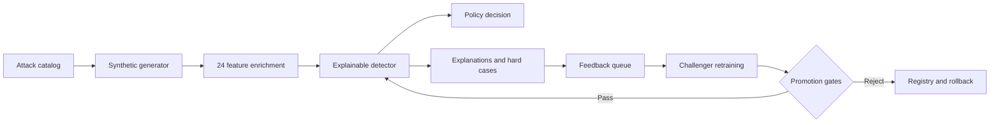

<div align="center">

# MasterShield AI

### Identify. Generate. Defend.

**An explainable payment-security lab for GenAI-enabled fraud**

</div>

> **Synthetic prototype:** all transactions, metrics, and attack scenarios are generated locally. This project does not connect to live payment systems or claim production performance.

## What it does

MasterShield turns emerging fraud hypotheses into measurable defense evidence through a closed loop:

```text
Identify threats → Generate synthetic attacks → Score and explain
       ↑                                             ↓
       └──────── Learn from misses and feedback ─────┘
```

The platform includes:

- 24 GenAI-enabled attack scenarios across cards, wallets, transfers, QR, identity, refunds, and acquiring
- Correlated synthetic payment, device, behavioral, graph, biometric, and language signals
- Explainable hybrid risk scoring with approve, review, hold, step-up, and decline actions
- Adaptive mutation search for detector blind spots
- Challenger retraining with immutable holdout checks, promotion gates, audit history, and rollback
- Interactive operations console with offline demo data

## Architecture



## Run locally

Requires Python 3.10+. No mandatory third-party packages.

```bash
python3 app.py
```

Open [http://127.0.0.1:8765](http://127.0.0.1:8765).

Useful commands:

```bash
make test       # run the test suite
make report     # generate a synthetic report in work/
make dataset    # export reproducible JSONL data in data/
make demo-data  # rebuild the offline demo snapshot
```

Optional SQLite persistence:

```bash
MASTERSHIELD_DB=work/mastershield.db python3 app.py
```

## 90-second demo

1. Open **Security overview** and show the current risk posture.
2. Search an attack in **Threat intelligence**.
3. Run it in **Simulation lab** at Base or High intensity.
4. Inspect detections, misses, explanations, and control false positives.
5. Submit feedback, retrain the challenger, and review promotion gates.
6. Finish with **Fidelity** and adaptive mutation search.

## API highlights

| Endpoint | Purpose |
| --- | --- |
| `GET /api/overview` | KPIs, stream state, decisions, and model evidence |
| `GET /api/attacks` | Attack catalog and detection rates |
| `POST /api/simulate` | Generate and score an adversarial stream |
| `POST /api/score` | Score one payment-shaped transaction |
| `POST /api/feedback` | Record an analyst outcome |
| `POST /api/retrain` | Train and evaluate a challenger model |
| `GET /api/fidelity` | Robustness and policy evidence |
| `GET /api/models` | Model registry and active version |
| `POST /api/models/rollback` | Restore a retained model snapshot |

Example:

```bash
curl -X POST http://127.0.0.1:8765/api/simulate \
  -H 'content-type: application/json' \
  -d '{"attack_ids":["atk-001","atk-005","atk-008"],"count":120,"intensity":1.1}'
```

## Repository map

```text
app.py                 HTTP / WSGI server and API routing
sentinel/              generator, detector, policy, governance, and engine
web/                   interactive console and offline snapshot
scripts/               dataset, report, and demo-data builders
tests/                 deterministic system tests
```

## Safety boundary

The red-team component mutates synthetic transaction features only. It does not generate phishing content, credentials, targets, evasion instructions, or live payment actions. Production integration would require tokenized events, durable storage, access controls, signed model artifacts, and confirmed fraud labels.

