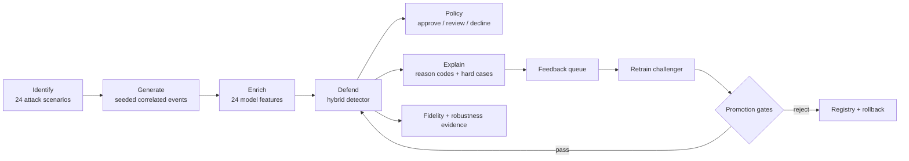

# MasterShield AI

### Identify. Generate. Defend.

MasterShield is a closed-loop payment-security lab for discovering GenAI-enabled fraud, generating realistic synthetic attacks, and improving an explainable defense model through feedback.

> Built for the Mastercard Innovation Challenge. All metrics and transactions in this prototype are synthetic evidence - not production claims.

## The core idea

```text
24 attack hypotheses → correlated payment stream → explainable risk decision
          ↑                                      ↓
          └──────────── hard cases + feedback ───┘
```

## Architecture



### How it works

1. **Identify** — `sentinel/taxonomy.py` defines 24 attack hypotheses across cards, wallets, RTP, QR, acquiring, identity, refunds, and social engineering.
2. **Generate** — `sentinel/generator.py` creates deterministic legitimate and attack transactions with correlated velocity, device, graph, identity, session, biometric, and language signals.
3. **Defend** — `sentinel/model.py` combines a weighted logistic model with transparent domain priors, calibrates a low-false-positive threshold, and returns feature-level explanations.
4. **Learn** — missed attacks, false positives, and analyst outcomes become hard cases for the next challenger model.
5. **Govern** — immutable holdout, robustness checks, promotion gates, model versions, audit events, and rollback keep the loop reviewable.

## Console wireframe

```text
┌──────────────────┬─────────────────────────────────────────────────────────┐
│ MASTERSHIELD     │  LIVE API     MODEL hybrid-logit-c02     0 queued       │
│                  ├─────────────────────────────────────────────────────────┤
│  Overview        │  F1 SCORE   ROC AUC   FPR       ATTACK COVERAGE         │
│  Attack intel    │  ┌────────┐ ┌────────┐ ┌────────┐ ┌──────────────┐      │
│  Simulation lab  │  │ 0.998  │ │ 1.000  │ │ 0.1%   │ │ 17 / 24      │      │
│  Defense model   │  └────────┘ └────────┘ └────────┘ └──────────────┘      │
│  Validation      │                                                         │
│  Fidelity        │  Red team → Generate → Defend → Learn                   │
│                  │  ┌────────────────────┐ ┌───────────────────────────┐   │
│  LOOP ACTIVE     │  │ risk distribution   │ │ recent payment decisions │   │
│  Cycle 02        │  │ legitimate / attack│ │ rail • amount • risk      │   │
│                  │  └────────────────────┘ └───────────────────────────┘   │
└──────────────────┴─────────────────────────────────────────────────────────┘
```

The UI includes animated metrics, attack search and filters, judge-ready simulation presets, transaction explanations, feedback capture, fidelity checks, mutation search, and model rollback.

## Run locally

Requires Python 3.10+; no mandatory third-party packages.

```bash
python3 app.py
```

Open <http://127.0.0.1:8765>. For a static review, open [`web/index.html`](web/index.html) directly; it uses the bundled offline snapshot.

Useful commands:

```bash
make test       # 29 deterministic tests
make report     # write a synthetic model report to work/
make dataset    # export reproducible JSONL to data/
```

Optional persistence:

```bash
MASTERSHIELD_DB=work/mastershield.db python3 app.py
```

## Key API

| Endpoint | Purpose |
| --- | --- |
| `GET /api/overview` | KPIs, stream, history, feature importance |
| `GET /api/attacks` | Attack catalog and live detection rates |
| `POST /api/simulate` | Generate and score an adversarial stream |
| `POST /api/score` | Score one payment-shaped transaction |
| `POST /api/feedback` | Record an analyst outcome |
| `POST /api/retrain` | Build and evaluate a challenger model |
| `GET /api/fidelity` | Fidelity, robustness, and policy evidence |
| `GET /api/models` | Model registry and promotion status |
| `POST /api/models/rollback` | Restore a retained model snapshot |

Example:

```bash
curl -X POST http://127.0.0.1:8765/api/simulate \
  -H 'content-type: application/json' \
  -d '{"attack_ids":["atk-001","atk-005","atk-008"],"count":120,"intensity":1.1}'
```

## Repository map

```text
app.py                 HTTP / WSGI server and API routing
sentinel/taxonomy.py   attack intelligence catalog
sentinel/generator.py  seeded synthetic transaction generator
sentinel/model.py      explainable hybrid fraud detector
sentinel/engine.py     closed-loop orchestration
sentinel/attacker.py   bounded synthetic blind-spot search
sentinel/fidelity.py   robustness and fidelity measurements
sentinel/governance.py challenger promotion and rollback gates
web/                   interactive operations console
scripts/               dataset, report, and offline-demo builders
tests/                 deterministic system tests
docs/                  architecture and demo runbook
```

## Safety boundary

The red-team component only mutates synthetic transaction features. It does not generate phishing content, credentials, targets, evasion instructions, or live payment actions. Production integration would replace the simulator with tokenized ISO 8583 / ISO 20022 events, durable storage, access controls, and confirmed fraud labels.

## Demo path

Open **Overview** → search an attack in **Attack intelligence** → click **Run** → inspect misses and explanations → submit feedback → **Retrain** → review **Validation / Fidelity** → compare model versions or roll back.
