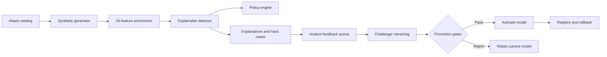

<div align="center">

# MasterShield AI

### Identify. Generate. Defend.

An explainable security research platform for evaluating AI-enabled payment fraud defenses.

</div>

> [!IMPORTANT]
> MasterShield is a synthetic research prototype. It generates transactions, attack scenarios, and evaluation metrics locally. It does not connect to payment networks, process real customer data, or represent production performance.

## Overview

MasterShield provides a closed-loop environment for testing payment fraud controls against emerging attack patterns. It combines a curated threat catalog, correlated synthetic transaction generation, explainable risk scoring, operational policy decisions, analyst feedback, and governed model retraining in one application.

The project is designed to answer a practical question: when a new fraud hypothesis appears, can the current defense detect it, explain the decision, learn from misses, and demonstrate that an updated model is measurably better?

## Core Capabilities

- **Threat intelligence:** 24 AI-enabled fraud scenarios spanning cards, wallets, transfers, QR payments, identity, refunds, and merchant acquiring.
- **Synthetic data generation:** reproducible payment streams with correlated transaction, device, behavioral, network, biometric, merchant, and language signals.
- **Explainable risk scoring:** a trainable logistic detector blended with domain controls and human-readable feature contributions.
- **Operational decisions:** configurable approve, review, step-up, hold, and decline actions based on risk and payment context.
- **Adaptive testing:** bounded mutation search that probes the detector for synthetic blind spots without producing live attack instructions.
- **Model governance:** challenger training, immutable holdout evaluation, promotion gates, model registry history, audit records, and rollback.
- **Interactive console:** a browser-based operations interface for exploring threats, simulations, decisions, validation evidence, and robustness.

## How It Works

```text
Threat catalog
      |
      v
Synthetic attack generation --> Feature enrichment --> Risk scoring
                                                        |
                                                        v
Analyst feedback <-- Explanations and hard cases <-- Policy decision
      |
      v
Challenger retraining --> Promotion gates --> Activate or reject
```



## Quick Start

### Prerequisites

- Python 3.10 or later
- GNU Make, optional but recommended for common tasks

The runtime uses only the Python standard library; no third-party Python package installation is required.

### Start the application

```bash
python3 app.py
```

Open [http://127.0.0.1:8765](http://127.0.0.1:8765) in a browser.

To use a different interface or port:

```bash
python3 app.py --host 0.0.0.0 --port 9000
```

### Enable SQLite persistence

By default, runtime events are held in memory. Set `MASTERSHIELD_DB` to persist feedback, simulations, audit events, and model metadata:

```bash
MASTERSHIELD_DB=work/mastershield.db python3 app.py
```

## Common Commands

| Command | Description |
| --- | --- |
| `make run` | Start the local application on port `8765` |
| `make test` | Run the deterministic system test suite |
| `make report` | Generate a model report at `work/model-report.json` |
| `make dataset` | Export 10,000 reproducible synthetic transactions as JSONL |
| `make demo-data` | Rebuild the static data snapshot used by the web console |

The scripts can also be executed directly:

```bash
python3 scripts/generate_dataset.py \
  --rows 10000 \
  --attack-rate 0.22 \
  --intensity 1.0 \
  --output data/synthetic_payments.jsonl

python3 scripts/train_model.py --report work/model-report.json
```

## Suggested Demo Flow

1. Open **Security Overview** to review the current model, risk posture, and synthetic event stream.
2. Use **Threat Intelligence** to inspect the attack catalog and leading indicators.
3. Select scenarios in **Simulation Lab** and run a base or high-intensity simulation.
4. Review detected attacks, misses, false positives, policy actions, and explanations.
5. Submit analyst feedback and train a challenger model.
6. Inspect promotion-gate results, validation evidence, fidelity measurements, and adaptive mutation findings.

## API Reference

All API responses use JSON unless CSV is explicitly requested. Write operations validate request fields, types, ranges, and body size.

| Method | Endpoint | Description |
| --- | --- | --- |
| `GET` | `/api/health` | Service status, API version, capabilities, and active model |
| `GET` | `/api/overview` | Current KPIs, decisions, validation evidence, and stream state |
| `GET` | `/api/attacks` | Attack catalog and scenario-level detection performance |
| `GET` | `/api/transactions?limit=100` | Recent scored transactions |
| `POST` | `/api/simulate` | Generate and score an adversarial synthetic stream |
| `POST` | `/api/score` | Score one payment-shaped transaction |
| `POST` | `/api/mutate` | Search for bounded synthetic feature mutations |
| `GET` / `POST` | `/api/feedback` | Read the feedback queue or submit an analyst outcome |
| `POST` | `/api/retrain` | Train and evaluate a challenger model |
| `GET` | `/api/fidelity` | Synthetic fidelity and robustness evidence |
| `GET` | `/api/report` | Consolidated model and policy report; supports `?format=csv` |
| `GET` | `/api/simulations` | Simulation history; supports `?format=csv` |
| `GET` | `/api/models` | Model registry and active version |
| `POST` | `/api/models/rollback` | Restore a retained model snapshot |
| `GET` | `/api/audit?limit=100` | Recent governance and lifecycle events |

### Run a simulation

```bash
curl -X POST http://127.0.0.1:8765/api/simulate \
  -H 'Content-Type: application/json' \
  -d '{
    "attack_ids": ["atk-001", "atk-005", "atk-008"],
    "count": 120,
    "intensity": 1.1
  }'
```

### Check service health

```bash
curl http://127.0.0.1:8765/api/health
```

## Project Structure

```text
MasterShield/
|-- app.py                    HTTP server, WSGI entry point, and API routing
|-- sentinel/
|   |-- attacker.py           Bounded adaptive mutation search
|   |-- contracts.py          API payload validation
|   |-- engine.py             Closed-loop orchestration
|   |-- features.py           Feature enrichment and vectorization
|   |-- fidelity.py           Fidelity and robustness measurements
|   |-- generator.py          Correlated synthetic payment generation
|   |-- governance.py         Challenger promotion gates
|   |-- model.py              Trainable detector, metrics, and explanations
|   |-- policy.py             Operational payment decisions
|   |-- quality.py            Dataset quality and drift checks
|   |-- storage.py            In-memory and optional SQLite event storage
|   `-- taxonomy.py           Fraud scenario catalog
|-- scripts/                  Dataset, report, and demo-data utilities
|-- tests/                    Deterministic system and API tests
|-- web/                      Interactive browser console
|-- Makefile                  Common development commands
`-- vercel.json               Vercel Python deployment configuration
```

## Testing

Run the complete test suite with:

```bash
python3 -m unittest discover -s tests -v
```

The tests cover attack-catalog integrity, deterministic generation, schema validation, scoring, feedback, retraining, holdout isolation, model rollback, fidelity, persistence, and HTTP/WSGI behavior.

## Deployment

The repository includes a Vercel configuration that deploys `app.py` as a Python WSGI application and bundles the `sentinel/` and `web/` directories. For local or self-hosted use, run the built-in threaded HTTP server directly.

## Safety and Scope

MasterShield operates exclusively on synthetic payment-shaped data. The adaptive testing component changes bounded numeric and categorical transaction features; it does not generate phishing content, credentials, target lists, evasion procedures, or instructions for interacting with real payment systems.

Before production use, the prototype would require substantial additional engineering, including authenticated and authorized access, tokenized event ingestion, durable managed storage, secrets management, encryption controls, signed model artifacts, observability, privacy review, confirmed fraud labels, operational runbooks, and independent security validation.
