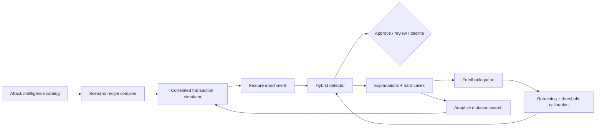

# MasterShield AI Architecture

## Core loop



## Data contract

The simulator uses a deliberately inspectable payment-shaped record. A production adapter would map equivalent fields from event streams:

- payment context: rail, channel, amount, currency, merchant category, tokenized / card-present state
- entity context: customer, account age, device age, merchant age, beneficiary novelty
- behavioral context: velocity, distance, session entropy, typing consistency, authentication method
- network context: IP reputation, mule graph score, synthetic identity score, descriptor drift
- GenAI context: semantic pressure, generated-language similarity, remote-access evidence, biometric risk

The generator moves related fields together. For example, a deepfake executive transfer is not only a large amount: it includes a new beneficiary, a high-pressure interaction, a bank-transfer rail, and elevated mule proximity. That causal bundle is what makes the synthetic data useful for stress testing.

## Model contract

1. Standardize the 24 engineered features on the current training set.
2. Fit a class-weighted logistic model with L2 regularization.
3. Blend the learned score with a small expert-prior score for high-confidence controls.
4. Calibrate the operating threshold under a 3.5% maximum false-positive rate.
5. Return top positive feature contributions with every decision.

The prototype's score is intentionally transparent. A production implementation could replace the learner with a gradient-boosted model or sequence model, but the decision contract and explanation layer should remain stable.

## Production path

```text
ISO 8583 / ISO 20022 / wallet events
        -> feature store (stream + batch)
        -> online graph + device enrichments
        -> low-latency risk service
        -> policy / step-up orchestration
        -> confirmed fraud + analyst outcomes
        -> red-team scenario generator + champion/challenger evaluation
```

The highest-risk migration items are label delay, cross-bank identity resolution, model drift, and customer-friction measurement. The live version should log reason codes, counterfactuals, and the exact feature snapshot used for each decision.

## Adaptive red-team boundary

`sentinel/attacker.py` searches a bounded feature-mutation space around synthetic attack transactions. It can reduce amount, pace, graph, device, behavioral, identity, language, biometric, and merchant signals to find lower-risk variants. Every candidate is marked `synthetic_only`, carries a mutation path, and stays inside the generated transaction schema. It does not produce phishing copy, credentials, targets, evasion instructions, or live payment actions.

## Evidence and governance

The fidelity endpoint compares synthetic streams using feature distribution distance, scenario-mix distance, profile summaries, low-intensity stress, unseen-family stress, missing-feature stress, and policy friction/loss estimates. The test holdout created during bootstrap is immutable across retraining. The API returns request IDs, validates payloads, and writes audit/model/feedback/simulation events to memory or SQLite.

The production path should replace the in-process store with a managed database/event stream, use tokenized identifiers, enforce role-based access and retention, and run the model in shadow mode before any payment action is enabled.
